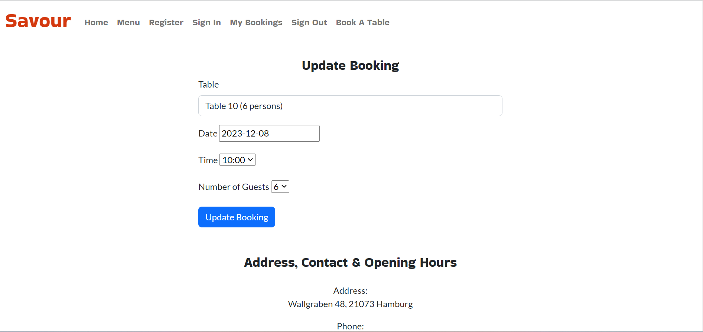

# "Savour"

- "Savour" is a restaurant website that enables customers to book a table online.
- People who would like to online book a table in a restaurant would benefit from using this website.
- I developed "Savour" as my project portfolio 4 for my remote, full-stack software development diploma with the Code Institute in Dublin, Ireland.
- The name of this project on Github is "restaurant", and its name on Heroku is "savour". The actual name of this project on the restaurant website is "Savour".

# 1. User stories:

## 1. 1. Admin wants to add new items to the menu

- As an admin, I want to add new items to the menu so that customers can see new food options.

## 1. 2. Admin wants to remove items from the menu

- As an admin, I want to remove items from the menu so that customers do not see options that are no longer available.

## 1. 3. Admin wants to edit existing menu items

- As an admin, I want to edit existing menu items so that I can update the details if they change.

## 1. 4. Admin wants to view all bookings

- As an admin, I want to view all bookings so that I can manage the restaurant’s reservations.

## 1. 5. Admin wants to prevent a double bookings

- As an admin, I can prevent a double booking so that I can guarantee that a table can't be booked twice for the same date and time.

## 1. 6. User wants to view the restaurant menu

- As a user, I want to view the restaurant menu so that I can see what food options are available.

## 1. 7. User wants to book a table for a specific date and time

- As a user, I want to book a table for a specific date and time so that I can plan my visit to the restaurant.

## 1. 8. User wants to specify the number of guests for their booking

- As a user, I want to specify the number of guests for my booking so that the restaurant can prepare the necessary meals and seating.

## 1. 9. User wants to receive a confirmation message as soon as they book a table

- As a user, I want to receive a confirmation message after booking a table so that I know my booking has been successfully recorded.

## 1. 10. User wants to be able to cancel their booking

- As a user, I want to be able to cancel my booking so that I can change my plans if necessary.

## 1. 11. User wants to be able to update a booking

- As a user, I want to update any of my bookings so that I my updated booking will suit my new needs and circumstances.

# 2. Existing features:

## 2. 1. Navigation bar

- The fully responsive navigation bar is featured on all pages, includes links to each of the logo, home, menu, register, sign in, my booking, sign out, and book a table pages and is identical on each page to allow for easy navigation.
- This section will allow a user to easily navigate from page to page across all devices without having to revert to the previous page via a "back" button.
- Below are two screenshots of the nav bar; the first on a loptop and the second on an iPhone.

## 2. 2. Landing page image

- The landing page image on the top center of the home page shows a table on which there are some delicious meals.
- Below are two screenshots of the landing page image; the first on a loptop and the second on an iPhone.

## 2. 3. "About Us" section

- This section is beneath the landing page image on the home page.
- It tells a user that "Savour" is a cozy, small family-owned restaurant located in Hamburg, Germany that offers its customers various, tasty, healthy meals and drinks.
- Additionally, it emphasizes that a customer can easily book a table online as soon as they will have registered on the restaurant website.
- Below are three screenshots of the "About Us" section; the first on a loptop and the second and third on an iPhone.

## 2. 4. Footer

- The footer is featured, identical, and fully responsive on all pages of the website.
- It demonstrates the restaurant address, contact, telephone number, email address, opening hours, and social media links to Facebook, Twitter, Instagram, and YouTube.
- Each social media link opens in a new tab.
- Below are three screenshots of the footer; the first on a laptop, the second on an iPad, and the third on an iPhone.

## 2. 5. Menu

- The restaurant menu exist on the menu page.
- It contains twelve items, each has an image, name, description, and price.
- All meals images are fully responsive on all screen sizes.
- Below are various screenshots of the restaurant menu; they are from top to bottom as follows: four screenshots on a laptop, three on a Blackberry, and eight on an iPhone.

## 2. 6. Register

- On the register page, there is a register form that enables a customer to register by entering a username, an email, and a password.
- A user must confirm their password.
- The register form urges a user to enter a username that is at least six characters long. It it was not, an error message will appear.
- The register form examines the right formula of an email. If its formula was not correct, an error message will appear.
- As a user enters their password, it must be at least eight characters long, otherwise an error message will appear.
- As a user confirms their password, the two must be identical; if not, an error message will become visible.
- If a registration has been successful, a confirmation message will emerge and a user will be simultaneously moved into the sign-in page and urged to sign in to be able to book a table.
- Below are eight screenshots of the register form. The first six are on a loptop, the seventh on an iPad, and the eighth on an iPhone.

## 2. 7. Sign In

- A sign-in form exists on the sign-in page.
- To sign in, a registered user must enter their username and password.
- A registered user must enter a valid username and password; if either a username or a password is not valid, an error message arises.
- As a user successfully signs in, a confirmation message materializes, and the user will be instantly taken into the booking page to be able to book a restaurant table.
- Beneath are six screenshots that demonstrate the sign-in form; the first four are on a laptop, the fifth on an iPad, and the sixth on an iPhone.

## 2. 8. Book a table

- A signed-in user can book a table in "Savour" my means of a booking form that is built in the "Book a table" page.
- To book a table, a user should choose a certain table from twelve tables for a specific date and time; the user should also choose a certain the number of guests that is 1, 2, 3, 4, 5, or 6.
- If the table, date, and time that a user chooses are already booked, an error message appears and encourages the user to choose another table, date, or time to be able to book a table.
- If a user chooses a number of guests that is not compatible with the capacity of the table that the user wants to book, an error message pops up and notifies the user about that.
- As a user successfully books a table, a confirmation message informs the user about that, and the user will be redirected into the "My Bookings" page, where they can check their bookings.
- Underneath are seven screenshots that illustrate the details of signing in above. The first five are on a laptop, the sixth on an iPad, and the seventh on an iPhone.

## 2. 9. My Bookings

- The "My Bookings" button appears on the nav bar only after a user will have signed in.
- Clicking on "My Bookings" will open the "My Bookings" page on the website.
- On "My Bookings" page, a signed-in user can see their bookings, update them, or cancel them.
- On each booking, there are all the details of that booking; underneath, there are two buttons: "Update Booking" and "Cancel Booking".
- If a user clicks inside a certain booking on the "Update Booking" button, a form for updating a booking opens up, on which a user can choose new settings to be applied for that booking; if these are available, that booking will be updated and the user will be redirected back into their "My Bookings" page, where they can find their updated booking. If these are not available, however, an error message arises, tells the user that those settings are already booked, and urges the user to choose other settings to be able to update their booking.
- If a user clicks inside a certain booking on the "Cancel Booking" button, a message pops up and asks the user if they are sure that they want to cancel that booking. If the user confirms their wish to cancel that booking by clicking on "OK", that booking will be cancelled and a message comes into sight confirming that that booking has successfully been cancelled.
- Below are eight screenshots that depict the "My Bookings" form; the first six are on a laptop, the seventh on an iPad, and the eighth on an iPhone.

## 2. 10. Sign Out

- The Sign Out button appears on the nav bar only after a user will have signed in.
- When a user clicks on the "Sign Out" button on the nav bar, a message appears confirming that they have successfully signed out. At the same time, the user will be redirected to the home page and the "My Bookings" and "Sign Out" buttons will disappear from the nav bar.

# 3. Future Features

- Expanding the restaurant menu with new meals and drinks.
- Incorporating a functionality that allows a user to buy meals and drinks online.
- Adding more tables that have new capacities.

# 4. Typography and color scheme

- Two Google fonts have been used: "Bakbak One" and "Lato".
- Four icons from Font Awesome have been implemented: Facebook, Twitter, Instagram, and YouTube.
- Four colors have been applied: #d4390f, #0000008c, #212529, and #FFFFFF.
- Nine background colors have been applied: #FFFFFF, #F8F9FA, #3B5998, #55ACEE, #AC2BAC, #DD4B39, #E8F0FE, #0D6EFD, and #DC3545.

# 5. Wireframes

- I created seven Balsamiq wireframes for my project "Savour".
- Down is a PNG image of the twelve screenshots of all seven wireframes.
- The screenshots are ordered in a way that reflects the functionalities of "Savour".

